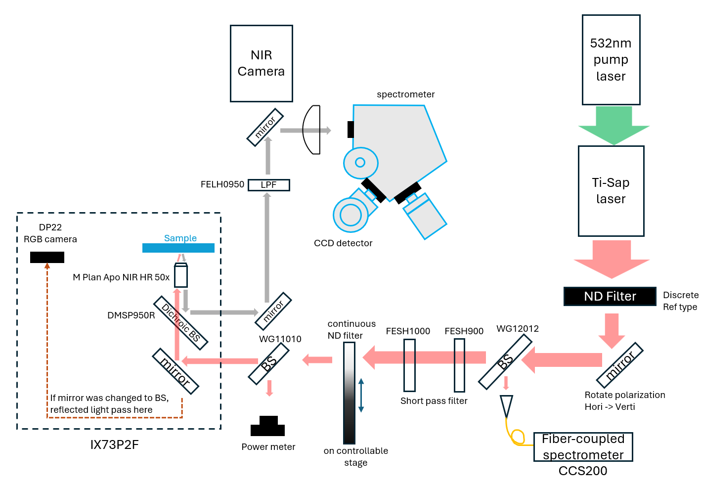

# PL連続NDフィルターの制御

src/

--Ophircom.py パワーメータのテストコード

--stage.py ステージのテストコード

--superchrome.py superchromeのテストコード

--main.py 全体の自動制御のテストコード

## ステージコントロール

[https://pylablib.readthedocs.io/en/latest/devices/Thorlabs_kinesis.html](https://pylablib.readthedocs.io/en/latest/devices/Thorlabs_kinesis.html)

pylablibを使用してpythonからの制御に成功

## パワメ数値取得
[OphirManual](docs/OphirLMMeasurement_COM_Object_0.pdf)

ophirのstarlabにpythonのデモがある

pythonからの数値取得に成功

## superchrome
[superchromeSDK](docs/SuperChromeSDK.pdf)

dllファイルから制御しよとしたときに4108エラーが発生。（金井がdelphiのサンプルコードを理解できていないのが原因。多分何とかなるハズ）

どうしようもないのでdll同梱の制御GUIを直接操作している
