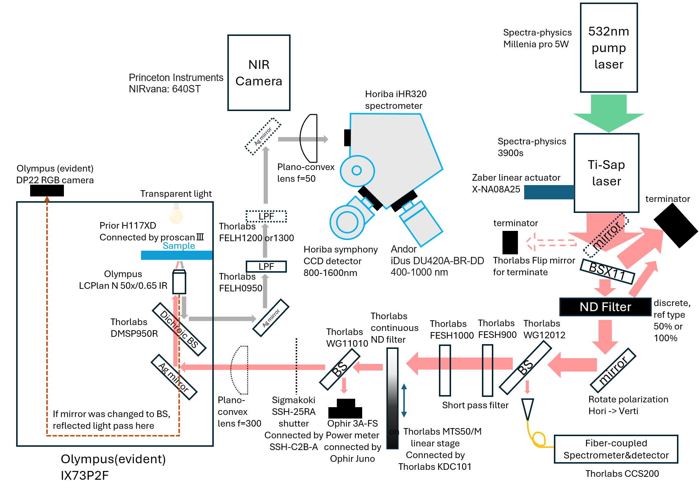
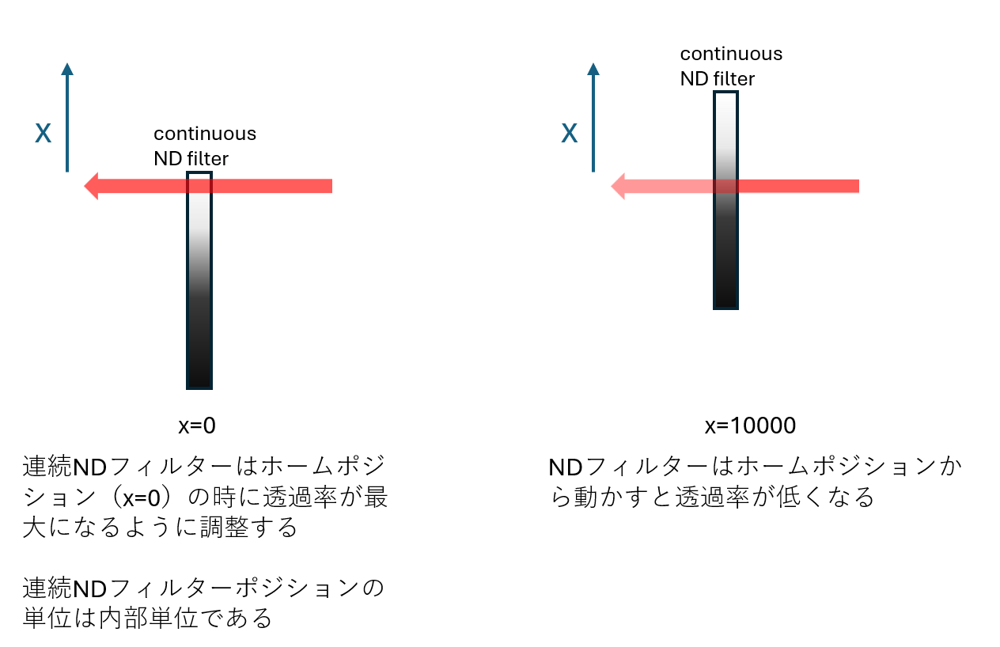
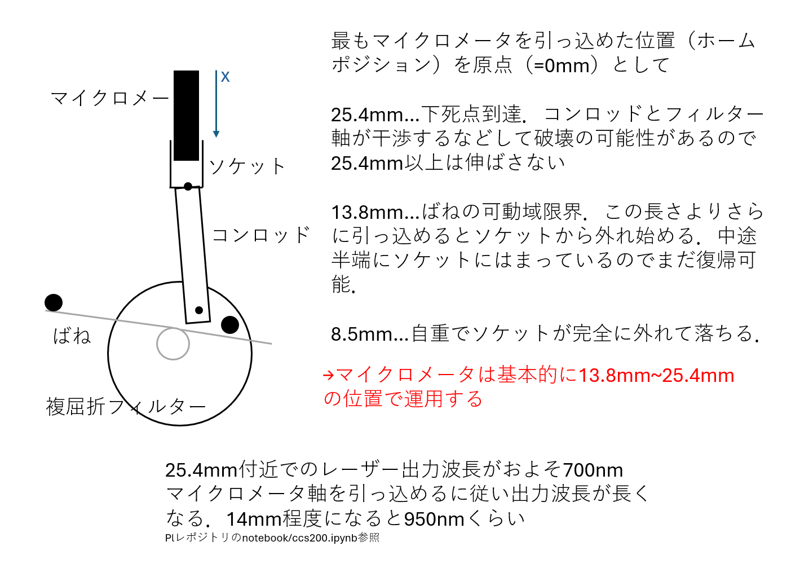

# PLスペクトル取得の基本的な流れ
pythonで3.11.9動作確認済み


1. レーザ前ミラーとシャッターの起動。二つで光路を遮断
2. NDフィルターを搭載したthorlabsステージの初期化
3. パワーメーター，検出器，チタンサファイアレーザーに搭載したzaberアクチュエータ，励起光波長フィードバック用簡易分光器，NDフィルターを搭載したthorlabステージの初期化
4. レーザ前ミラーを開く
5. マッピング測定なら測定ポイントに移動
6. 励起光波長をPID制御
7. 励起光パワーをPID制御\
(7.1. 必要であれば波長700nmでオートフォーカス)\
8. シャッターを開き、レーザーをサンプルに照射
9. CCD検出器を露光しデータを取得
10. シャッターを閉じる
11. 検出器からおくられてきたデータをリネーム。指定されたフォルダに"励起光波長.txt"として保存
12. 励起光最短波長から励起光最長波長まで励起光波長間隔ごとにずらしながら5~10を繰り返す
13. シャッターとレーザ前ミラーを閉じて終了

# ディレクトリ構成

```
.
├── data...notebookで使うデータを保存するフォルダ
├── arduino/arduino_auto_focus...オートフォーカス用のarduinoのスケッチを保存するフォルダ
│   └── arduino_auto_focus.ino...オートフォーカス用のarduinoのスケッチ
├── docs
│   └── readme用の画像等
├── notebook
│   ├── analyse.ipynb...パワーメータの結果からステージにおけるパワーを推定する式を導出するためのノートブック
|   ├── ccs200.ipynb...簡易分光器CCS200のデータを解析するためのノートブック
│   ├── ple.ipynb...PLEマップのデータを解析，2次元ピークフィッティングを行うためのノートブック
│   └── tisp.ipynb...チタンサファイアレーザーのデータを解析するためのノートブック
├── src
│   ├── config.py...各デバイスの設定を記述している
│   ├── emit_excitation_window.py...励起光照射君のGUI．このスクリプトを実行するとGUIが立ち上がる
│   ├── func.py...main関数等で使う数式を記述している
│   ├── logger.py...ログを記録するためのクラス定義
│   ├── power_dict.py...パワーメータの制御高速化のために辞書型でデータを保存するためのクラス定義
│   ├── main.py...メインスクリプト．計測の中心となる部分の関数を記述している
|   ├── dev_scan_ple__window.py...PLEスペクトルのマッピング測定を行うためのGUI．このスクリプトを実行するとGUIが立ち上がる．最新機能が反映されている．
│   ├── scan_ple_window.py...PLEスペクトルのマッピング測定君のGUI．このスクリプトを実行するとGUIが立ち上がる
│   ├── single_ple_window.py...PLEスペクトル測定のGUI．このスクリプトを実行するとGUIが立ち上がる
│   ├── scan_image_window.py...NIRカメラによるマッピング画像測定のGUI．このスクリプトを実行するとGUIが立ち上がる
│   ├── zaber_tool.py...zaber社製のアクチュエータを直接操作するためのGUI．このスクリプトを実行するとGUIが立ち上がる
│   ├── focus_tool.py...オートフォーカス用のarduinoを直接操作するためのGUI．このスクリプトを実行するとGUIが立ち上がる
│   └──driver
│       ├── brimrose.py...brimrose社製AOTFの制御のためのクラス定義
│       ├── fianium.py...fianium社製LVTFであるsuperchromeの制御のためのクラス定義
│       ├── focus_adjuster_driver.py...オートフォーカス用arduinoの制御のためのクラス定義
│       ├── horiba.py...horiba jovan yvon社製の分光器iHR320とCCD検出器symphonyの制御のためのクラス定義
│       ├── ophir.py...ophir社製のパワーメーターの制御のためのクラス定義
│       ├── princeton.py...princeton instruments社製のNIRカメラの制御のためのクラス定義
│       ├── prior.py...prior社製のステージコントローラーの制御のためのクラス定義
│       ├── sigmakoki.py...sigmakoki社製のシャッターコントローラーの制御のためのクラス定義
│       ├── thorlabs.py...thorlabs社製のNDフィルター用ステージコントローラー，レーザー前フリップミラー，励起光波長フィードバック制御用の簡易分光器の制御のためのクラス定義
│       └── zaber.py...チタンサファイアレーザーに取り付けたzaber社製のアクチュエータの制御のためのクラス定義
├── .gitignore...gitで無視するファイルを指定するファイル
├── install.bat...必要なライブラリをインストールするためのバッチファイル
├── PLEマップのマッピング測定.bat...PLEマップのマッピング測定君を起動するためのバッチファイル
├── PLEマップ測定君.bat...PLEマップ測定君を起動するためのバッチファイル
├── PL探索.bat...PL探索君を起動するためのバッチファイル
├── README.md...このファイル
├── requirements.txt...必要なライブラリを示したファイル
├── update.bat...必要なライブラリをアップデートするためのバッチファイル
|── zaber_tool.bat...zaber直接操作ツールを起動するためのバッチファイル
└── 励起光照射君.bat...励起光照射君を起動するためのバッチファイル


```

# 各種機器の制御について

## 励起光パワー制御用のNDフィルター部ステージの制御
thoalbas社製のNDフィルター部ステージを制御するためにpylablibというpip配布のライブラリを使用している。

[https://pylablib.readthedocs.io/en/latest/devices/Thorlabs_kinesis.html](https://pylablib.readthedocs.io/en/latest/devices/Thorlabs_kinesis.html)

NDフィルターの向きは下図参照


## 励起光パワー計測用のパワーメータ3A-FSの制御
ophir社製のパワーメーター3A-FSの制御にはophirの公式マニュアルを参考にCOMオブジェクトを使用している。
パワーメータ自体は3A-FSであるが，同社のjunoというインターフェースデバイスを介してPCと通信している。

[OphirManual](docs/OphirLMMeasurement_COM_Object_0.pdf)


## ~~superchrome~~
~~[superchromeSDK](docs/SuperChromeSDK.pdf)~~

~~dllファイルから制御しようとしたときに4108エラーが発生。（金井がdelphiのサンプルコードを理解できていないのが原因。多分何とかなるハズ）~~

~~面倒くさいのでdll同梱の制御GUIをpywinautoによって直接操作している~~

## ~~分光器 ihR320~~

~~こちらもpywinautoで直接MonoExampleを操作している~~

## 検出器 symphony

pywinautoでhoriba jovan ybonがサンプルとして配布しているCCDExampleを直接操作している

## 簡易分光器 CCS200

thorlabのマニュアルを参考にdllから直接スペクトル取得を行っている

## シャッター

sigmakoki社製のシャッターを制御するためにpyserialを用いてシリアル通信を行っている

## レーザー前ミラー

thorlabs社製のレーザー前ミラーを制御するためにpylablibを使用している

## チタンサファイアレーザーの波長制御

チタンサファイアレーザーの波長を制御するためにチタンサファイアレーザーの複屈折フィルター部にzaber社製のアクチュエータを取り付けている。zaber社製のアクチュエータを制御にはzaberが公式に配布しているzaber-motionというpip配布のライブラリを使用している。

リニアアクチュエータの安全運用位置の目安は下図参照


## オートフォーカス

オートフォーカス用のarduinoを制御するためにpyserialを用いてシリアル通信を行っている

## サンプルステージ

prior社製のサンプルステージを制御してマッピング測定を行うためにpyserialを用いてシリアル通信を行っている

## NIRカメラ
princeton社製のNIRカメラを制御するためにprincetonが公式に配布しているSDKを使用している。
NIR data reader code is copied from [https://github.com/sliakat/SpeReadPy](https://github.com/sliakat/SpeReadPy) very thnaks to [@sliakat](https://github.com/sliakat)